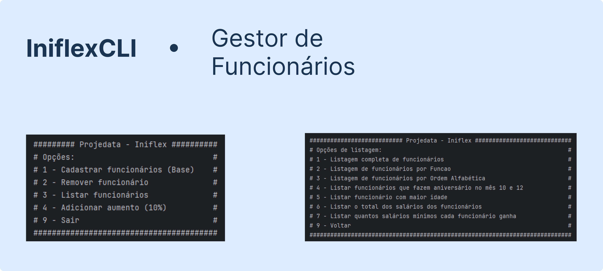

# 👨🏻‍💻 IniflexCLI  

 

**Sistema de gestão de funcionários em Java com interface via console**  

O **IniflexCLI** é uma aplicação de linha de comando voltada para a gestão de funcionários, com foco em atender às demandas dos setores Financeiro e de Suprimentos em indústrias de diversos segmentos. 

---

## 🔧 Funcionalidades  

✅ **Gerenciamento de Funcionários**

- Inserir todos os funcionários, na mesma ordem e informações da tabela.
- Remover funcionários da lista.
- Imprimir todos os funcionários com todas as suas informações, sendo que:
  - Exibir a data no formato `dd/mm/aaaa`.
  - Exibir os valores numéricos com separador de milhar como ponto e decimal como vírgula.
- Imprimir todos os funcionários agrupados por função.
- Imprimir os funcionários que fazem aniversário nos meses 10 e 12.
- Imprimir o funcionário com a maior idade, exibindo os atributos: nome e idade.
- Imprimir a lista de funcionários em ordem alfabética.
- Imprimir o total dos salários dos funcionários.
- Imprimir quantos salários mínimos ganha cada funcionário, considerando que o salário mínimo é **R$1212,00**.


---

## ⚙️ Tecnologias Utilizadas  
- **Java**

---

## 🚀 Como Usar? 

#### Pré-requisitos
- Java JDK 24 (Versão utilizada no desenvolvimento)
- Git instalado
- Verifique com: java -version e javac -version

#### Execução Direta pelo Terminal (Recomendado e testado)

```bash
# 1. Clone o repositório
git clone https://github.com/DutraA45/IniflexCLI
cd IniflexCLI

# 2. Compile o projeto
javac -d out src/*.java

# Se aparecer aviso de "deprecated API" é normal, continue...

# 3. Execute o programa
java -cp out Main
```

#### IntelliJ IDEA (Recomendado e testado)

- Baixe e instale o IntelliJ IDEA Community (gratuito)
- File → Open → Selecione a pasta do projeto
- Configure o JDK 24 (se necessário):
  - File → Project Structure
  - Project → Project SDK → Add JDK
- Selecione a pasta do JDK 24
- Execute:
  - Encontre a classe Main em src/
  - Execute a Main.java

#### Para Outras IDEs

Caso prefira utilizar outra IDE além do IntelliJ IDEA, consulte a documentação oficial do ambiente de sua escolha para instruções detalhadas sobre:

- Como importar projetos Java existentes
- Configuração do JDK 24
- Compilação e execução de aplicações Java

---

## 📄 Licença  
Projeto livre para uso e adaptação, desde que citada a autoria.  

---  
Feito com ❤️ por Dutra